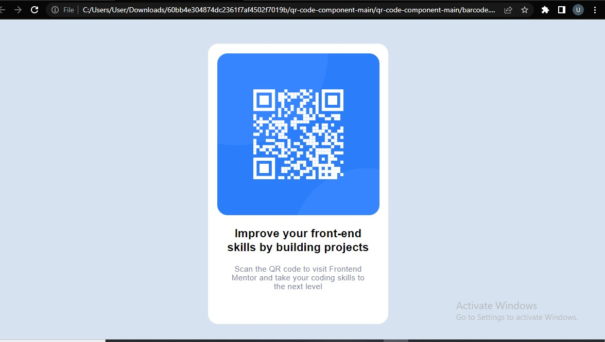

# Frontend Mentor - QR code component solution

This is a solution to the [QR code component challenge on Frontend Mentor](https://www.frontendmentor.io/challenges/qr-code-component-iux_sIO_H).

## Table of contents

- [Overview](#overview)
  - [Screenshot](#screenshot)
  - [Links](#links)
- [My process](#my-process)
  - [Built with](#built-with)
  - [What I learned](#what-i-learned)
  - [Continued development](#continued-development)
  - [Useful resources](#useful-resources)
- [Author](#author)
- [Acknowledgments](#acknowledgments)

**Note: Delete this note and update the table of contents based on what sections you keep.**

## Overview
Barcode Designed with flexbox

### Screenshot




### Links

- Solution URL: [Add solution URL here](https://your-solution-url.com)
- Live Site URL: [Add live site URL here](https://your-live-site-url.com)

## My process

### Built with

- Semantic HTML5 markup
- CSS custom properties
- Flexbox

### What I learned

I was able to recap the previous codes which i've learnt for long


```html
<div>A div</Div>
```
```css
.proud-of-this-css {
  justify-content: center;
  text-align: center;
  display: flex;
  flex-direction: column;
}

### Continued development

i will like to focus more on flexbox, responsiveness of a website(media queries) and also be able to design a website perfectly with accurate measurement

### Useful resources.

- [traversy media](https://www.example.com) - This helped me alot on building website projects and also learned more about flexbox and media queries on his crash courses
- [W3 school](https://www.example.com) - This site helped me in learning html and also learned how to use them.

## Author

- Website - [Usman Tanko Rabiu](https://www.your-site.com)
- Frontend Mentor - [@usmanrab](https://www.frontendmentor.io/profile/usmanrab)
- Twitter - [@usmanrab212](https://www.twitter.com/usmanrab212)


## Acknowledgments

i will like to use this medium to thank traversy media because this platform helped me alot, explained what i was having difficulty with and also exposed me to new things that i didnt know before.
